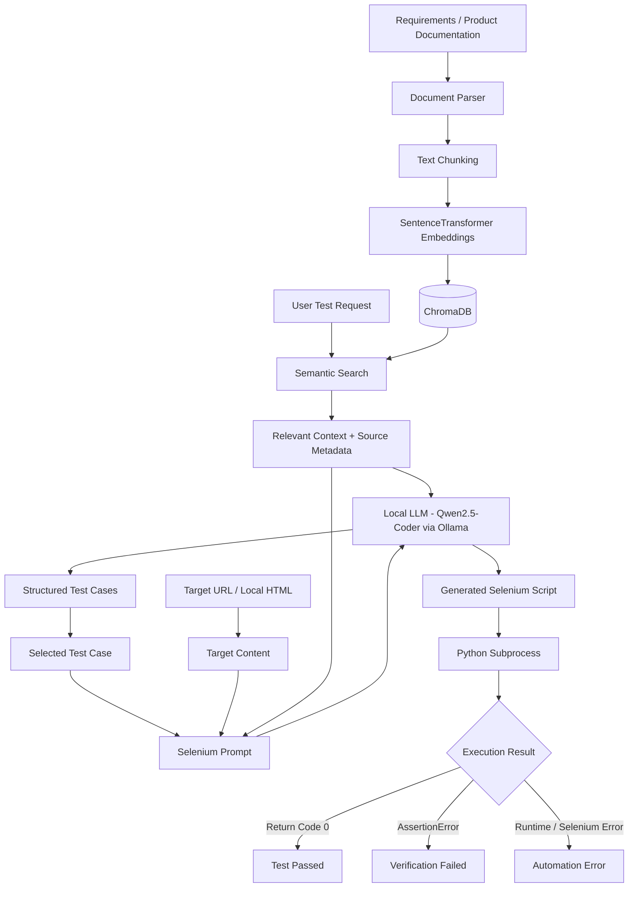

# AI-Powered Verification & Test Generation Assistant

A local-first Generative AI application that converts software requirements into structured test cases, generates Selenium automation scripts, and executes those scripts directly from a Streamlit interface.

The project combines Retrieval-Augmented Generation (RAG), local LLM inference, vector search, and browser automation to create a practical AI-assisted software verification workflow.

---

## Table of Contents

- [Project Overview](#project-overview)
- [Key Features](#key-features)
  - [RAG-Based Test Generation](#rag-based-test-generation)
  - [Source-Aware Grounding](#source-aware-grounding)
  - [Local LLM Inference](#local-llm-inference)
  - [Structured Test Cases](#structured-test-cases)
  - [Reusable Target Application Path](#reusable-target-application-path)
  - [Selenium Script Generation](#selenium-script-generation)
  - [Automated Selenium Execution](#automated-selenium-execution)
- [Why Local Ollama Instead of Hosted LLM APIs?](#why-local-ollama-instead-of-hosted-llm-apis)
- [Test Result Classification](#test-result-classification)
- [Architecture](#architecture)
- [Tech Stack](#tech-stack)
- [Project Structure](#project-structure)
- [UI Preview](#ui-preview)
- [Setup](#setup)
- [Usage](#usage)
- [Engineering Enhancements](#engineering-enhancements)
- [Limitations](#limitations)
- [Future Improvements](#future-improvements)
- [Learning Outcomes](#learning-outcomes)
- [License & Acknowledgements](#license--acknowledgements)
- [Author](#author)

---


## Project Overview

Traditional test creation often requires engineers to manually read requirements, identify test scenarios, write automation scripts, and then execute those scripts separately.

Link for Project Demo: https://drive.google.com/file/d/1v4GORwi0kskJRbNfgvserJLqUYIwqmlF/view?usp=sharing 

This project brings those steps into one workflow:

```text
Requirements / Product Documentation
                ↓
            Parsing
                ↓
            Chunking
                ↓
        Local Embeddings
                ↓
            ChromaDB
                ↓
       Semantic Retrieval
                ↓
       Relevant Context
                ↓
      Local LLM via Ollama
                ↓
      Structured Test Cases
                ↓
   Selected Test Case + Target Page
                ↓
     Selenium Script Generation
                ↓
       Automated Test Execution
                ↓
 PASS / Verification Failure / Automation Error
```

The application is designed to keep the RAG and test-generation workflow easy to inspect and explain, while still demonstrating a realistic end-to-end AI engineering pipeline.

---

## Key Features

### RAG-Based Test Generation

Uploaded engineering or product documentation is:

- parsed into plain text,
- split into smaller chunks,
- converted into embeddings using `sentence-transformers`,
- stored in ChromaDB,
- retrieved using semantic similarity search when a test-generation request is submitted.

Only the most relevant chunks are passed to the LLM, helping ground generated test cases in the uploaded documentation.

---

### Source-Aware Grounding

Retrieved context preserves source metadata before being sent to the LLM.

Generated test cases can therefore include traceability such as:

```text
Grounded_In: product_specs.md - REQ-012
```

This makes it easier to understand which document and requirement influenced a generated test.

---

### Local LLM Inference

The main generation workflow runs locally through:

```text
Ollama
   ↓
Qwen2.5-Coder 7B Instruct
```

The model is used for:

- structured test-case generation,
- requirement interpretation,
- Selenium script generation.

This avoids requiring a hosted LLM for the primary workflow and allows the project to run using local inference on consumer hardware.

---

## Why Local Ollama Instead of Hosted LLM APIs?

The project uses **Ollama with Qwen2.5-Coder 7B Instruct** as the primary generation layer instead of relying exclusively on hosted services such as OpenAI or Gemini.

This was a deliberate engineering choice rather than simply a model swap.

### Local-first inference

With Ollama, the model runs on the local machine instead of sending every prompt to a remote inference provider. This makes the generation pipeline easier to experiment with locally and removes a hard dependency on an external API for the main workflow.

```text
Hosted API

Application
    ↓
Internet request
    ↓
External model provider
    ↓
Generated response


Local Ollama

Application
    ↓
localhost
    ↓
Ollama
    ↓
Qwen2.5-Coder 7B Instruct
    ↓
Generated response
```

### No per-request API cost

Once the model has been downloaded, test-case and Selenium generation can run without consuming paid API credits for each request. This is useful during development because prompt changes, debugging, and repeated test generation can otherwise create recurring inference costs.

### Better control over the inference environment

Running the model locally provides direct control over:

- the model being used,
- generation parameters such as temperature and token limits,
- model availability,
- when the model is upgraded or replaced,
- how the application communicates with the inference layer.

The application communicates with Ollama through its local HTTP API, keeping the LLM layer separate from the Streamlit interface and RAG logic.

### Suitable for code-oriented generation

`Qwen2.5-Coder 7B Instruct` was selected because the project requires the model to handle both:

- structured QA test-case generation, and
- Python/Selenium code generation.

Using a code-oriented instruction model provides a practical balance between local hardware requirements and the type of output the application needs.

### Trade-offs

Local inference is not automatically better than a hosted model.

On consumer hardware, a 7B model can be:

- slower than cloud-hosted inference,
- less reliable on complex reasoning,
- more likely to hallucinate unsupported behavior or selectors,
- limited by available RAM and GPU memory.

Hosted models such as OpenAI or Gemini may provide stronger reasoning and faster inference on large cloud infrastructure. The purpose of using Ollama here is to demonstrate a **local, controllable inference architecture** while accepting the limitations of a smaller model.

For this reason, generated test cases and automation scripts should still be reviewed before being treated as authoritative verification evidence.

---

### Structured Test Cases

The application generates JSON-based test cases containing fields such as:

```json
{
  "Test_ID": "TC001",
  "Feature": "Checkout Validation",
  "Test_Scenario": "Successful payment with valid customer information",
  "Steps": [
    "Navigate to the checkout page",
    "Enter a valid name",
    "Enter a valid email address",
    "Enter a valid address",
    "Click Pay Now"
  ],
  "Expected_Result": "The application displays 'Payment Successful!'",
  "Grounded_In": "product_specs.md - REQ-012"
}
```

Multiple generated cases are displayed independently in Streamlit so each scenario can be reviewed and automated separately.

---

### Reusable Target Application Path

The target page URL or local HTML path only needs to be entered once.

The same target is reused across all generated test cases instead of requiring the path to be entered repeatedly.

For local Windows files, the application automatically converts paths such as:

```text
D:\Projects\RAG-Test-Case-Generator\templates\checkout.html
```

into a Selenium-compatible URI:

```text
file:///D:/Projects/RAG-Test-Case-Generator/templates/checkout.html
```

The resolved target is also passed to the LLM so generated Selenium scripts use the real application path instead of placeholder URLs.

---

### Selenium Script Generation

For each generated test case, the application combines:

- the selected test case,
- retrieved RAG context,
- the target application's page source,
- the resolved application path,

and generates a runnable Selenium Python script.

Generated scripts can also be downloaded as `.py` files.

---

### Automated Selenium Execution

Generated Selenium scripts can be executed directly from the Streamlit interface.

The application:

1. saves the generated script as a Python file,
2. launches it in a separate subprocess,
3. uses the same Python virtual environment as the Streamlit application,
4. applies an execution timeout,
5. captures standard output and error output,
6. reports the result in the UI.

This closes the loop between AI-generated test design and actual browser-based verification.

---

## Test Result Classification

Execution results are separated into three categories.

### ✅ Test Passed

The Selenium script completes successfully and all assertions pass.

```text
TEST PASSED — 6.68 seconds
```

### ❌ Verification Failed

The script executes, but an assertion fails because the observed application behavior does not match the expected result.

Example:

```text
Expected: Payment Successful!
Actual: Payment Failed
```

This may indicate a mismatch between the expected behavior and the application result.

### ⚠️ Automation Error

The Selenium script cannot complete successfully because of a runtime or automation problem.

Examples include:

- invalid generated selectors,
- missing elements,
- unsupported generated scenarios,
- Selenium timeouts,
- WebDriver errors,
- invalid generated Python code.

Keeping automation errors separate from assertion failures prevents every failed execution from being treated as an application defect.

---

## Architecture



---

## Tech Stack

| Area | Technology |
|---|---|
| Language | Python |
| Frontend | Streamlit |
| Local LLM Runtime | Ollama |
| LLM | Qwen2.5-Coder 7B Instruct |
| Embeddings | Sentence Transformers |
| Vector Database | ChromaDB |
| RAG | Custom Python retrieval workflow |
| Browser Automation | Selenium |
| API Layer | FastAPI |
| Document Parsing | PyMuPDF, BeautifulSoup |
| Data Exchange | JSON |
| Version Control | Git / GitHub |

---

## Project Structure

```text
RAG-Test-Case-Generator/
│
├── ui.py
├── rag_agent.py
├── vectorstore.py
├── parser_utils.py
├── api.py
│
├── support_docs/
│   └── product_specs.md
│
├── templates/
│   └── checkout.html
│
├── uploads/
│
├── requirements.txt
├── README.md
├── LICENSE
└── .gitignore
```

Runtime-generated folders such as virtual environments, Python caches, generated Selenium tests, and vector-database artifacts can be excluded from version control.

---

## UI Preview

Link for Project Demo: https://drive.google.com/file/d/1v4GORwi0kskJRbNfgvserJLqUYIwqmlF/view?usp=sharing 

---

## Setup

### 1. Clone the Repository

```bash
git clone <your-repository-url>
cd RAG-Test-Case-Generator
```

---

### 2. Create a Virtual Environment

#### Windows PowerShell

```powershell
python -m venv .venv
.\.venv\Scripts\Activate.ps1
```

---

### 3. Install Python Dependencies

```powershell
pip install -r requirements.txt
```

---

### 4. Install Ollama

Install Ollama for your operating system, then verify:

```powershell
ollama --version
```

---

### 5. Pull the Local Model

```powershell
ollama pull qwen2.5-coder:7b-instruct
```

Verify the model is available:

```powershell
ollama list
```

---

### 6. Start the Application

```powershell
streamlit run ui.py
```

Streamlit will provide a local URL, typically:

```text
http://localhost:8501
```

---

## Usage

### Step 1 — Upload Documentation

Upload one or more supported files through the Streamlit sidebar.

Supported formats include:

```text
.txt
.md
.json
.pdf
.html
.htm
```

Click:

```text
Ingest Documents
```

The application parses the files and stores their vector representations in ChromaDB.

---

### Step 2 — Generate Test Cases

Enter a request such as:

```text
Generate 7 test cases for checkout validation.
```

The application performs semantic retrieval against the knowledge base and sends the retrieved context to the local LLM.

---

### Step 3 — Review Generated Test Cases

Each generated scenario is displayed independently.

Review:

- test ID,
- feature,
- test scenario,
- steps,
- expected result,
- grounding source.

---

### Step 4 — Enter the Target Application

Provide either:

```text
https://example.com/checkout
```

or a local file path:

```text
D:\Projects\RAG-Test-Case-Generator\templates\checkout.html
```

The target only needs to be entered once and is reused for all generated test cases.

---

### Step 5 — Generate Selenium Automation

Expand a test case and select:

```text
Generate Selenium Script
```

The application generates a Python Selenium script using the selected test case and target application.

---

### Step 6 — Execute the Test

Select:

```text
Run Test
```

Chrome launches automatically and Selenium performs the generated test steps.

The Streamlit interface then displays:

```text
PASS
VERIFICATION FAILED
or
AUTOMATION ERROR
```

along with execution time and any relevant traceback or console output.

---

## Engineering Enhancements

Several changes were introduced to make the workflow more practical for software verification.

### Local Inference

The generation layer was configured to run through Ollama using Qwen2.5-Coder 7B Instruct, reducing dependence on paid hosted inference for the main workflow.

### End-to-End Test Execution

The workflow was extended beyond Selenium code generation so scripts can be executed directly from the application.

### Execution Result Classification

Test execution now distinguishes successful tests, assertion-based verification failures, and Selenium/runtime automation errors.

### Shared Target Configuration

The target application path or URL is entered once and reused across all generated test cases.

### Target-Aware Script Generation

The resolved application URI is included directly in the Selenium generation prompt, preventing placeholder file paths in generated scripts.

### Persistent Generated Scripts

Generated Selenium scripts are stored in Streamlit session state so they remain available across Streamlit reruns.

### Source Metadata Preservation

RAG retrieval preserves source filenames in the context provided to the LLM, improving traceability between generated tests and the documentation used to generate them.

### Defensive JSON Parsing

The application handles multiple reasonable LLM response structures, including direct JSON arrays and wrapped `test_cases` objects.

---

## Limitations

Local models provide a cost-efficient and private development workflow, but smaller models may occasionally:

- infer unsupported behavior,
- generate unnecessary test steps,
- create incorrect selectors,
- produce invalid Python syntax,
- misinterpret a requirement.

Generated automation should therefore be reviewed before being treated as authoritative verification evidence.

The current target inspection approach works best with static or server-rendered HTML. Modern React, Vue, or Angular applications may require rendered-DOM extraction after JavaScript execution for more reliable selector grounding.

---

## Future Improvements

Potential extensions include:

- rendered-DOM extraction for JavaScript-heavy applications,
- syntax validation before executing generated Python,
- selector validation before launching Selenium,
- automated screenshots on test failure,
- richer verification reports,
- test execution history,
- requirement-to-test traceability views,
- support for additional local and hosted LLM providers,
- CI/CD integration for generated tests.

---

## Learning Outcomes

This project provides hands-on experience with:

- Retrieval-Augmented Generation,
- embeddings,
- semantic similarity search,
- vector databases,
- prompt design,
- local LLM inference,
- structured LLM outputs,
- grounding and hallucination limitations,
- Selenium automation,
- subprocess execution,
- software verification workflows,
- Streamlit application development.

---

## License & Acknowledgements

This repository retains the applicable open-source license and copyright notices associated with components originally released under the MIT License.

See the `LICENSE` file for details.

---

## Author

**Kris Soni**

Computer Science graduate focused on Data Engineering, Analytics, AI applications, and software engineering.
